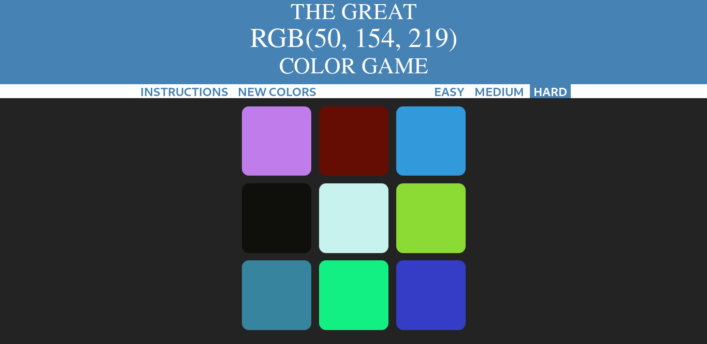
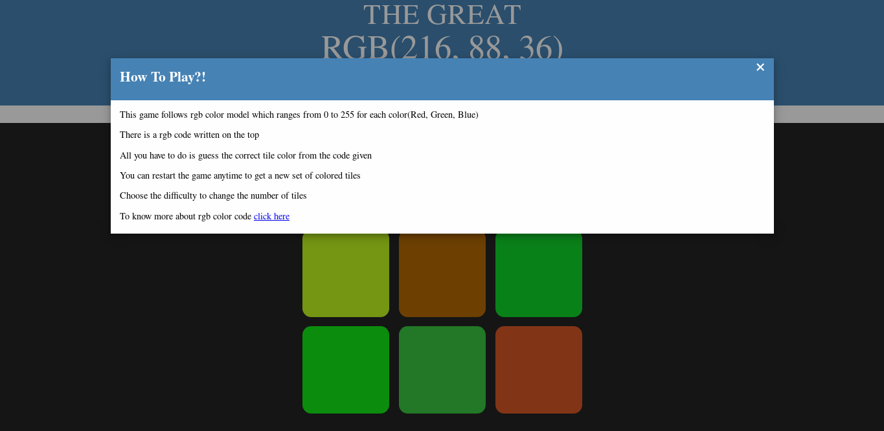
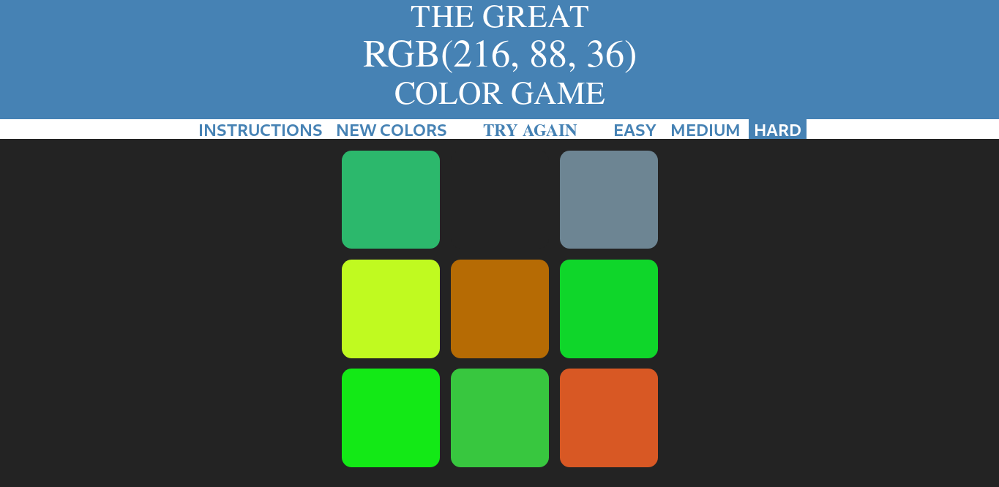
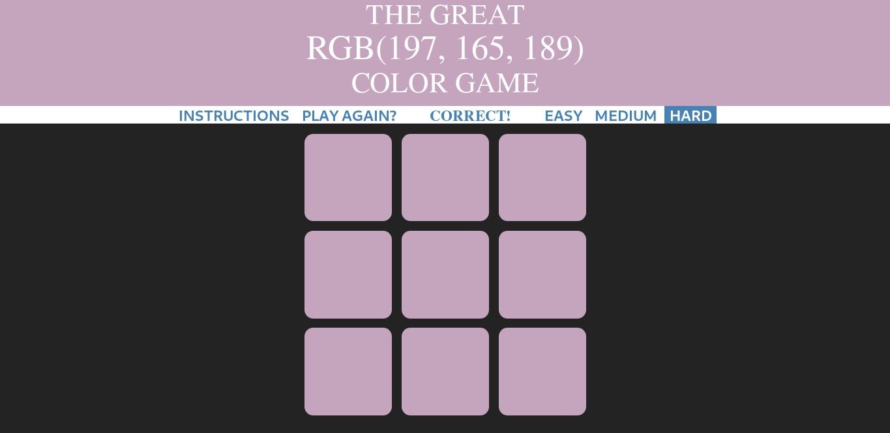

# Color-Game

A web game where you guess the color of the tile from the RGB color model stated.

	<h2>The Game</h2>
	 
	<h2>The Instructions</h2>
	 
	<h2>Block Disappears on Wrong Guess</h2>
	 
	<h2>Choose the Right Color to WIN</h2>
	

## Happy Gaming
